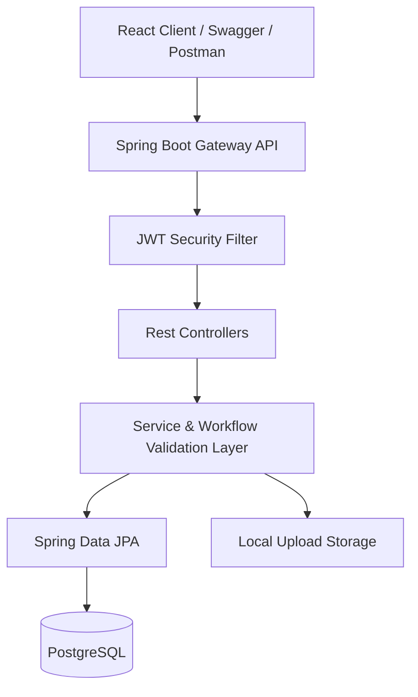
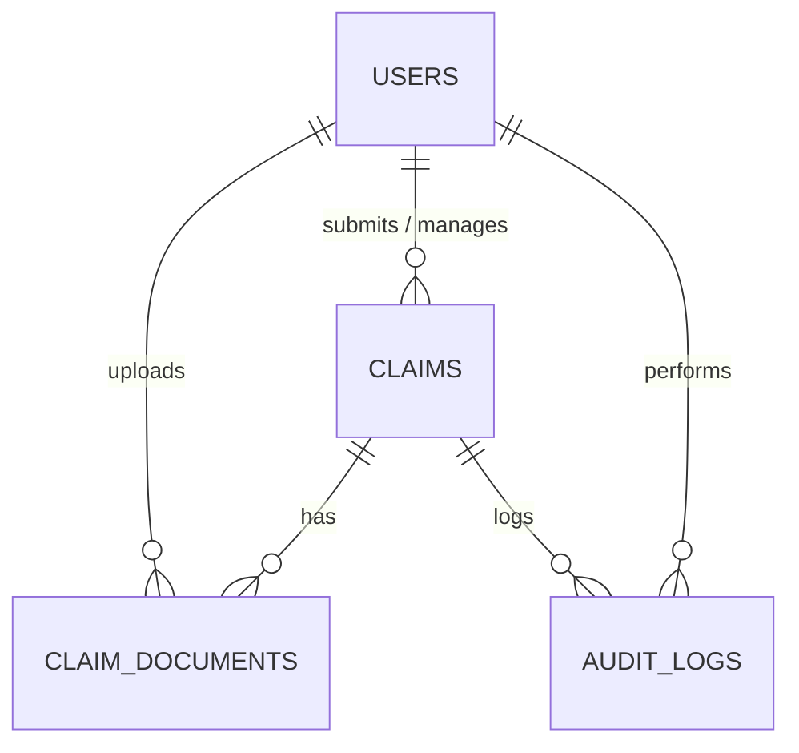
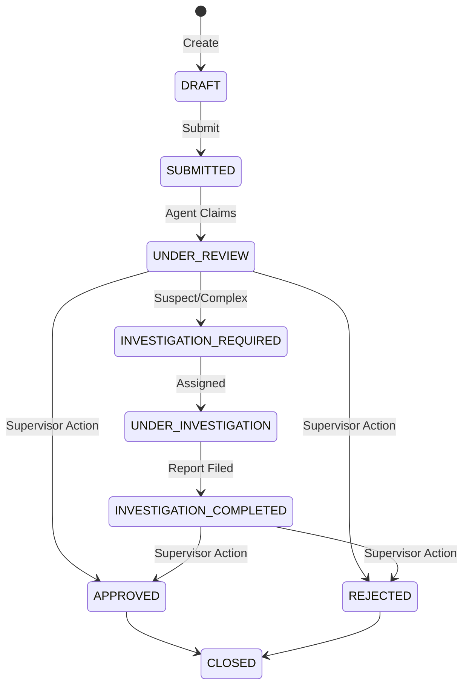

# Enterprise Insurance Claim Processing System (ICPS)

ICPS is a state-of-the-art, secure web application designed to handle the complete lifecycle of insurance claims. Built with a robust Java/Spring Boot backend and a modern React/TypeScript/Vite frontend, the system facilitates seamless claim submission, role-based workflows, strict state transition validation, local document management, and comprehensive audit trails.

---

## 🚀 Key Features

### 👥 Multi-Role User Workflows
*   **Customer:** Draft claims, upload supporting files (PDF, JPG, PNG up to 10MB), submit claims, and monitor progress.
*   **Claim Agent:** Perform initial reviews of submitted claims, add notes, and trigger investigations when details are complex or suspicious.
*   **Investigator:** Execute detailed investigations, record findings, and finalize investigation reports.
*   **Supervisor:** Review completed claims and make final approvals or rejections.

### 🛡️ Security & Authentication
*   State-of-the-art **JWT-based stateless authentication**.
*   Role-Based Access Control (RBAC) securing all REST API endpoints.
*   Secure password hashing using **BCrypt**.
*   Database credentials and SMTP configurations dynamically loaded from **Environment Variables** (safely hidden from GitHub).

### 📊 Rich Dashboards & Reporting
*   Interactive stats detailing total users, active claims, and statuses.
*   Advanced search, sorting, and pagination across all claim registries.
*   Immutable **Audit Timeline** tracking claim creation, state changes, file uploads, and reviewer actions.

---

## 🛠️ Technology Stack

### Backend
*   **Framework:** Spring Boot 4.x
*   **Database:** PostgreSQL 18.4 (using HikariCP connection pooling)
*   **ORM:** Hibernate 7.x / Spring Data JPA
*   **Security:** Spring Security (Stateless JWT Filter)
*   **Docs:** Swagger UI / OpenAPI 3.0
*   **Mail:** JavaMailSender (Mock SMTP integration)

### Frontend
*   **Language:** React + TypeScript (Vite bundler)
*   **Styling:** Tailwind CSS + Vanilla CSS (Aesthetic glassmorphism, modern typography)
*   **Icons:** Lucide React
*   **Networking:** Axios (with request/response interceptors for automatic session handling)

---

## 🏛️ System Architecture



### Database Schema Entity Relationships



### Claim State Transitions (Workflow Engine)



---

## ⚙️ Running Locally

### 1. Database Setup
Create a PostgreSQL database named `icps_db`:
```sql
CREATE DATABASE icps_db;
```

### 2. Environment Variables & Credentials
To run without exposing passwords on Github, the application retrieves database credentials via environment variables. If these variables are not set on your machine, it defaults to:
*   **DB URL:** `jdbc:postgresql://localhost:5432/icps_db`
*   **DB User:** `postgres`
*   **DB Password:** `12345`

You can override these values in production/development without modifying the codebase by setting the following env variables:
```bash
SPRING_DATASOURCE_URL=jdbc:postgresql://your-host:5432/db_name
SPRING_DATASOURCE_USERNAME=your_username
SPRING_DATASOURCE_PASSWORD=your_password
```

---

## 🧑‍💻 How to Start the App

### Step A: Launch the Backend
Open a terminal in the project root (`d:\Personal\ClaimFlow`) and run:
```powershell
mvn spring-boot:run
```
The server will boot on `http://localhost:8080`.
*   *Note: On the first boot, the database seeder will run automatically, wiping any stale mock data and establishing default testing roles.*

### Step B: Launch the Frontend
Open a **new** terminal window, navigate to the frontend directory, and run:
```powershell
cd frontend
npm install
npm run dev
```
Open your browser and navigate to `http://localhost:5173`.

---

## 🔑 Default Testing Credentials

The database seeder pre-populates the system with different user accounts. Use these credentials to test the various dashboards:

| Role | Email Address | Password |
| :--- | :--- | :--- |
| **Admin** | `admin@icps.com` | `Employee@ClaimFlow` |
| **Supervisor** | `sup1@icps.com`, `sup2@icps.com` | `Employee@ClaimFlow` |
| **Investigator** | `inv1@icps.com` to `inv4@icps.com` | `Employee@ClaimFlow` |
| **Claim Agent** | `agent1@icps.com` to `agent4@icps.com` | `Employee@ClaimFlow` |
| **Customer** | `cust1@icps.com` to `cust5@icps.com` | `1234567` |

---

## 🌐 API Reference & Testing
Swagger API documentation is integrated directly into the backend. With the backend running, visit:
*   **OpenAPI Specs:** [http://localhost:8080/swagger-ui/index.html](http://localhost:8080/swagger-ui/index.html)
