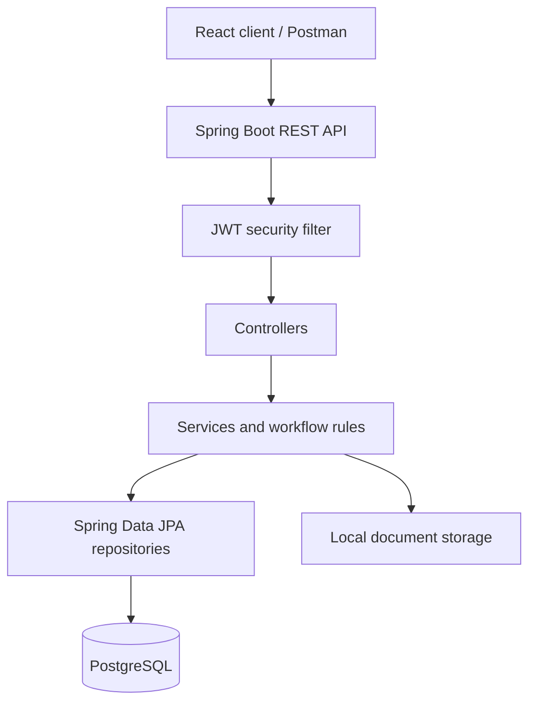
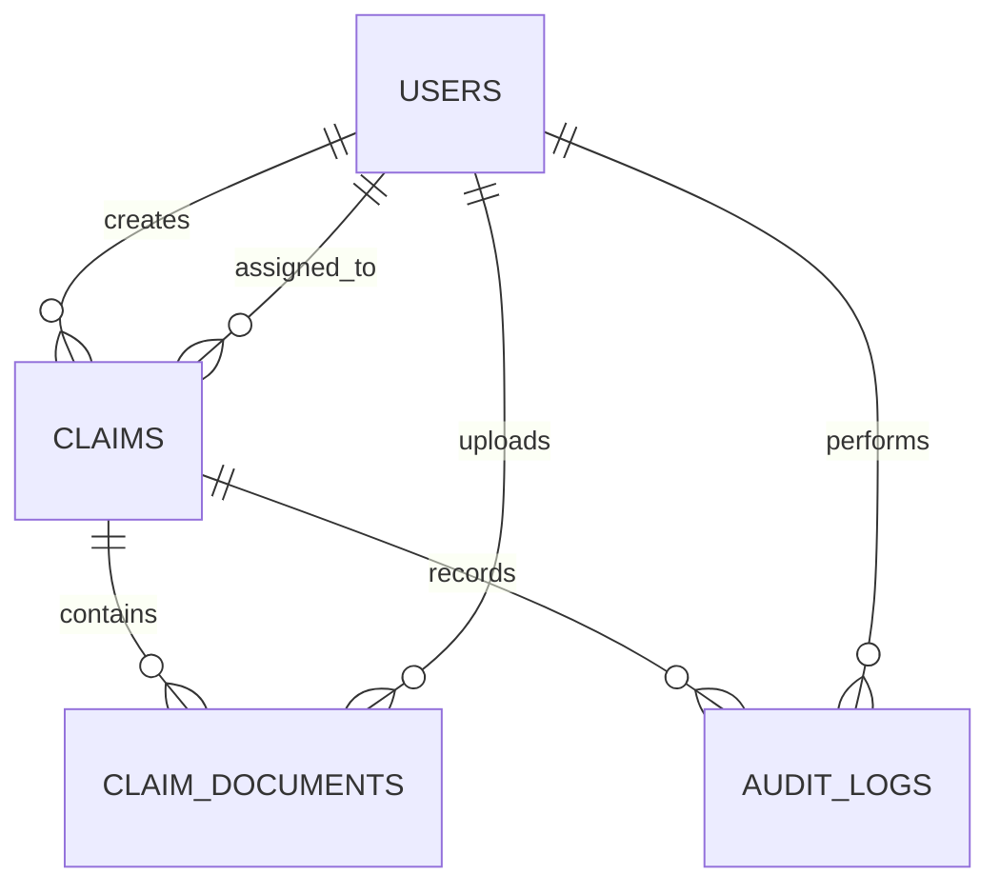
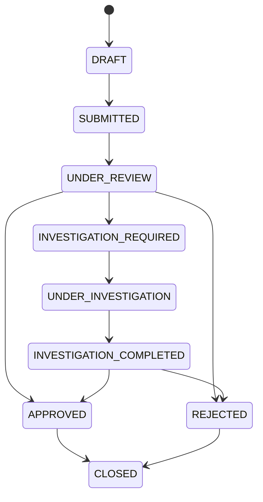
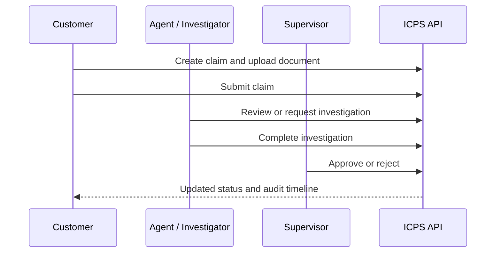

# Insurance Claim Processing System (ICPS)

ICPS is a Spring Boot REST API for submitting, reviewing, investigating, and deciding insurance claims. It uses JWT authentication, role-based authorization, PostgreSQL persistence, local document storage, and OpenAPI documentation.

## Features

- Customer claim lifecycle: draft, upload documents, submit, and track status.
- Agent, investigator, and supervisor workflow with enforced state transitions.
- Document upload/download for PDF, JPG, and PNG files up to 10 MB.
- Role-scoped dashboards, claim search, sorting, and pagination.
- Immutable audit timeline for claim creation, submissions, status changes, and uploads.
- Swagger UI and centralized validation/error responses.

## Architecture

## Database schema

## Claim workflow

## Run locally

1. Create a PostgreSQL database named `icps_db`.
2. Update the `spring.datasource` values in `src/main/resources/application.yml` for your local database.
3. Run `mvn spring-boot:run`.
4. Open Swagger UI at `http://localhost:8080/swagger-ui.html`.

Java 26 and Maven are required by the current project configuration.

## API quick reference

| Area | Endpoints |
| --- | --- |
| Authentication | `POST /api/auth/register`, `POST /api/auth/login` |
| Claims | `POST/GET /api/claims`, `GET/PUT/DELETE /api/claims/{id}`, `POST /api/claims/{id}/submit` |
| Documents | `POST/GET /api/claims/{id}/documents`, `GET/DELETE /api/documents/{id}` |
| Workflow | `GET /api/workflow/claims`, workflow actions under `/api/workflow/claims/{id}` |
| Reporting | `GET /api/dashboard/customer`, `/agent`, `/supervisor` |
| Search | `GET /api/claims/search?status=&claimType=&fromDate=&toDate=&customerName=&policyNumber=&page=&size=&sortBy=&sortDir=` |
| Audit timeline | `GET /api/claims/{claimId}/timeline?page=0&size=10` |

All endpoints except registration and login require `Authorization: Bearer <token>`. List and search endpoints support zero-based `page`, `size`, `sortBy`, and `sortDir` parameters.

## API flow

